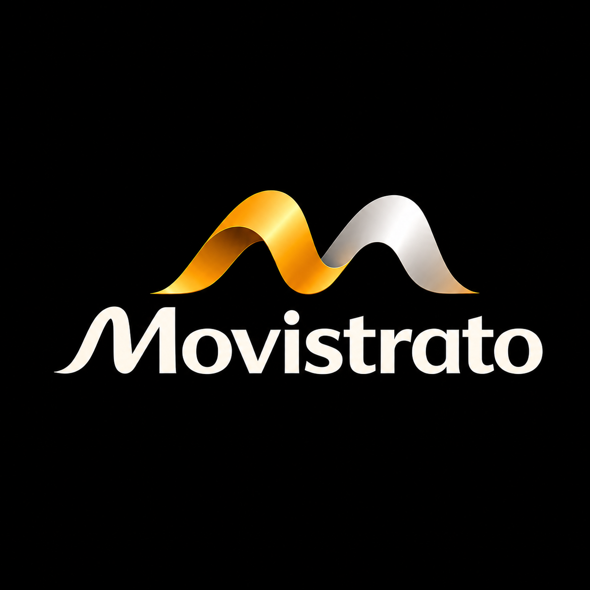
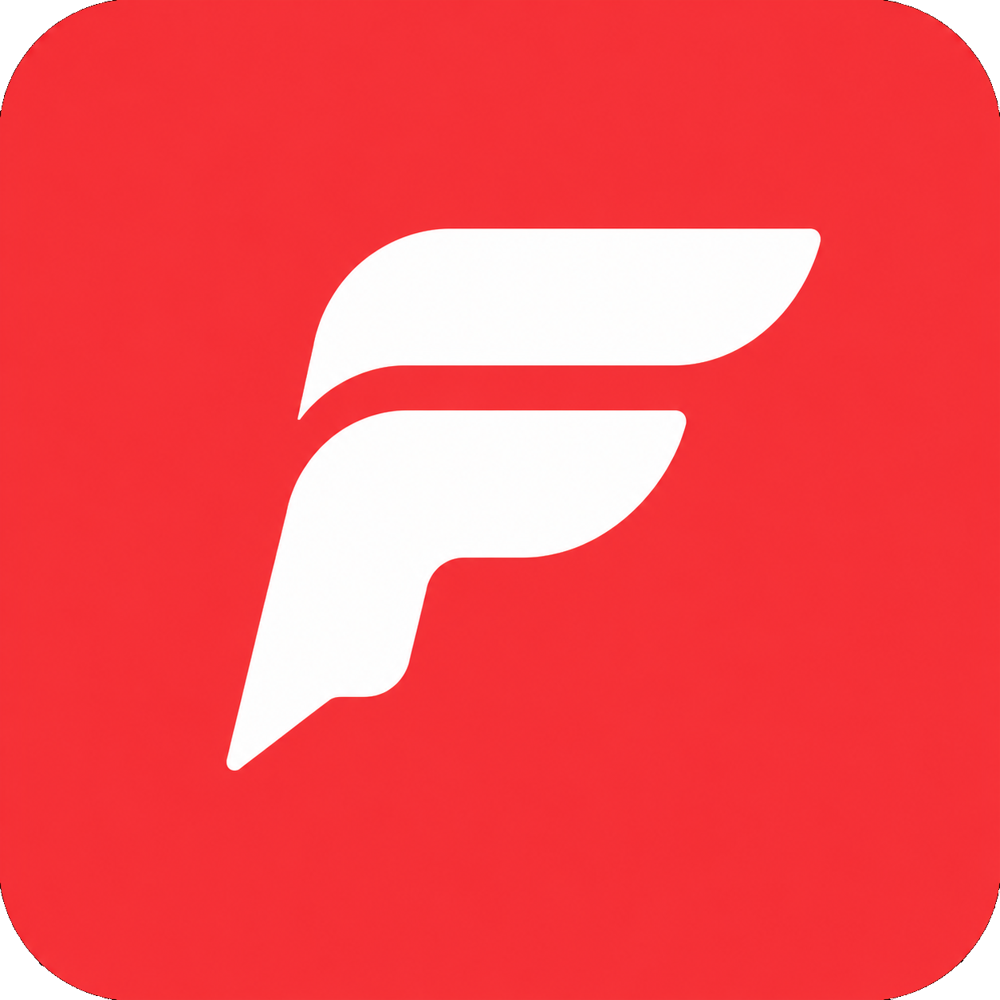

<div align="center">



<br/>
<br/>


<br/>

# We build software with intent.

### Ambitious digital products. Thoughtful engineering. Experiences people actually want to use.

<br/>

<a href="https://github.com/Movistrato">

</a>

 

<a href="https://movistrato.com">

</a>

 

<a href="mailto:hello@movistrato.com">

</a>

<br/>
<br/>

</div>

---

<div align="center">

> **Movistrato is an independent software company building ambitious digital products.**

</div>

<br/>

## ✦ About Movistrato

Movistrato is a software company focused on creating products that combine thoughtful design, strong engineering and emerging technology.

We believe the best software sits at the intersection of three things:

**usefulness · simplicity · ambition**

We build products from the ground up — from the first idea and interface to the underlying systems that make them work.

Our goal is not to build software for the sake of building software.

**Our goal is to build things worth using.**

---

## ◈ What We Believe

<table width="100%">
<tr>

<td width="33%" valign="top">

### 01

## Make it simple.

Complexity belongs in the architecture — not in the user's experience.

We obsess over interfaces that feel natural, clear and effortless.

</td>

<td width="33%" valign="top">

### 02

## Build it properly.

A beautiful interface means very little if the system underneath cannot scale.

Performance, reliability, maintainability and security matter from day one.

</td>

<td width="33%" valign="top">

### 03

## Think bigger.

We deliberately choose problems that are interesting enough to be difficult.

The first version is only the beginning.

</td>

</tr>
</table>

---

# 🚀 Products

## Faro

<div align="center">



<br/>
<br/>

### A different way to learn languages.

</div>

Faro is our first flagship product: a language-learning application built around a different interaction model.

Instead of making learning feel like a sequence of traditional exercises, Faro explores a more natural experience centred around **reading, discovery, intelligent content and personalised learning**.

The idea is simple:

> **What if learning a language felt less like studying and more like discovering something you genuinely want to read?**

Faro combines product design, learning mechanisms, algorithms and AI to create a more adaptive experience.

### Designed for the ecosystem around the learner

```text
                         FARO
                           │
          ┌────────────────┼────────────────┐
          │                │                │
        WEB              MOBILE           DESKTOP
          │                │                │
      Browser          Android            Windows
                         iOS               macOS
                                           Linux
```

### Core ideas

* Intelligent learning systems
* Personalised content
* AI-assisted experiences
* Reading-first interaction
* Cross-platform architecture
* Fast, responsive interfaces
* Continuous experimentation

<br/>

<a href="https://github.com/Movistrato/Faro">

</a>

---

# ⚡ The Technology

We don't believe a company should be defined by a programming language.

**The problem comes first. The technology follows.**

Our current engineering ecosystem includes:

<br/>

### Web & Product

<a href="https://skillicons.dev">

</a>

<br/>
<br/>

### Applications

<a href="https://skillicons.dev">

</a>

<br/>
<br/>

### Backend & Data

<a href="https://skillicons.dev">

</a>

<br/>
<br/>

### Infrastructure

<a href="https://skillicons.dev">

</a>

<br/>
<br/>

### AI & Intelligent Systems

<a href="https://skillicons.dev">

</a>

<br/>

> **Our stack is a tool, not an identity.**
>
> As our products evolve, our technology evolves with them.

---

# 🧠 How We Engineer

We treat software development as a continuous loop rather than a straight line.

```text
              ┌─────────────────────┐
              │       PROBLEM       │
              └──────────┬──────────┘
                         │
                         ▼
              ┌─────────────────────┐
              │     UNDERSTAND      │
              └──────────┬──────────┘
                         │
                         ▼
              ┌─────────────────────┐
              │       DESIGN        │
              └──────────┬──────────┘
                         │
                         ▼
              ┌─────────────────────┐
              │       BUILD         │
              └──────────┬──────────┘
                         │
                         ▼
              ┌─────────────────────┐
              │       MEASURE       │
              └──────────┬──────────┘
                         │
                         ▼
              ┌─────────────────────┐
              │      ITERATE        │
              └──────────┬──────────┘
                         │
                         └───────────────►
                              REPEAT
```

We care about the details users see and the systems they never will.

That means:

* Clean architecture
* Strong typing
* Automated testing
* Performance
* Accessibility
* Observability
* Secure infrastructure
* Maintainable code
* Thoughtful APIs
* Deliberate product decisions

---

# 🏗️ Engineering Principles

| Principle                 | What it means                                   |
| ------------------------- | ----------------------------------------------- |
| **User first**            | Technology exists to serve the product.         |
| **Simple by default**     | Complexity must earn its place.                 |
| **Fast by design**        | Performance is part of the experience.          |
| **Built to evolve**       | Architecture should accommodate change.         |
| **Automate what repeats** | Humans should solve interesting problems.       |
| **Measure reality**       | Opinions are useful; evidence is better.        |
| **Quality compounds**     | Small decisions accumulate into great products. |

---

# 🌍 Where We Build

<table width="100%">
<tr>

<td align="center" width="25%">

## Web

Modern browser experiences built for speed, accessibility and scale.

</td>

<td align="center" width="25%">

## Mobile

Native-feeling experiences designed around real-world usage.

</td>

<td align="center" width="25%">

## Desktop

Powerful software that doesn't sacrifice simplicity.

</td>

<td align="center" width="25%">

## AI

Intelligence integrated where it creates meaningful value.

</td>

</tr>
</table>

---

# 🔬 Beyond Products

Not everything starts as a product.

Some ideas begin as experiments.

Our repositories may contain:

```text
/products
    Production software

/experiments
    Prototypes and technical research

/packages
    Reusable libraries and components

/tools
    Developer utilities

/infrastructure
    Systems powering our products

/.github
    Engineering standards and company workflows
```

Some experiments will disappear.

Some will become products.

That's part of building.

---

# 👤 Leadership

<div align="center">


<br/>

## Miguel Pereira Santos

### Founder & CEO

Founder of Movistrato and the person currently leading the company's product, engineering and strategic direction.

His work spans:

`Product` · `Software Engineering` · `Architecture` · `Design` · `Strategy`

Movistrato began as an independent idea and is being built with the ambition of becoming a company capable of creating products that stand on their own.

<br/>

<a href="https://github.com/imperador1k">

</a>

</div>

---

# 📂 The Organization

This GitHub Organization is the engineering home of Movistrato.

As the company grows, this space will evolve with it.

```text
Movistrato
│
├── Products
│   └── Software people use
│
├── Engineering
│   └── Systems that make it possible
│
├── Experiments
│   └── Ideas worth testing
│
├── Open Source
│   └── Technology worth sharing
│
└── People
    └── Engineers, designers and builders
```

---

# 📍 Today

Movistrato is at the beginning.

That means there is no enormous catalogue of products yet.

There doesn't need to be.

There is a first product.

There is an engineering foundation.

There is a company being built.

And there is a long way to go.

### Current focus

**Faro**

Language learning · AI · Personalisation · Cross-platform software

**Movistrato Platform**

Product infrastructure · Design systems · Developer tooling

**Company**

Product development · Engineering foundations · Sustainable growth

---

# 🔮 What's Next

We are building the foundation for a company capable of creating multiple products over time.

Today:

```text
                    FARO
                     │
                     ▼
              Product Foundation
                     │
                     ▼
              Engineering System
```

Tomorrow:

```text
                  MOVISTRATO
                      │
          ┌───────────┼───────────┐
          ▼           ▼           ▼
       Product A   Product B   Product C
```

One company.

Multiple ideas.

One engineering standard.

---

<br/>

<div align="center">


<br/>
<br/>

## Build something worth using.

<br/>

**Movistrato**

*Software, built with intent.*

<br/>

<a href="https://github.com/Movistrato">

</a>

<br/>
<br/>

<sub>

Founded & led by <strong>Miguel Pereira Santos</strong> · Movistrato © 2026

</sub>

<br/>
<br/>

</div>


